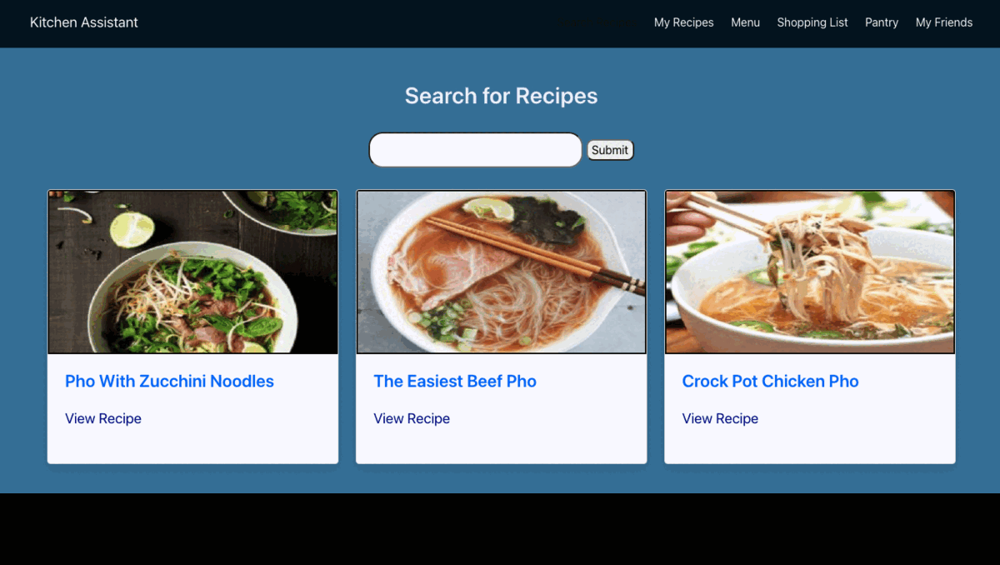
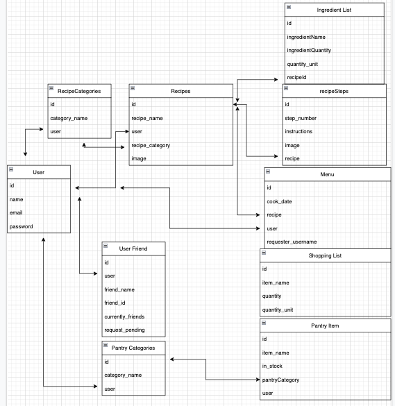

# Kitchen-Assistant v2.0

The original kitchen assistant was built on the Expres/EJS stack, and was a website allowing users to efficiently manage logistics in their kitchen. This updated version is built with Django for its backend, React for frontend, and provides additional functionality.


[Kitchen-Assistant v2.0 via Heroku](https://kitchen-assistantv2-frontend.herokuapp.com/)

[Kitchen-Assistant Github Repository (Frontend)](https://github.com/justinluu8235/kitchen-assistant-frontend)

[Kitchen-Assistant Github Repository (Backend)](https://github.com/justinluu8235/kitchen-assistant-django-api)

[Oriignal v1 Kitchen-Assistant EJS-Express Github Repository](https://github.com/justinluu8235/kitchen-assistant)


## `Give it a Try`
* <a href="https://kitchen-assistantv2-frontend.herokuapp.com/">Go to the live site here</a>

* Follow these installation instructions
    * clone the repo and run it
    * run npm install
    * set up a .env with a REACT_APP_SERVER_URL for backend connection (can also clone our <a href="https://github.com/justinluu8235/kitchen-assistant-django-api">backend repo</a>)
    * run npm start


## Original Kitchen Assistant Key Features
- Recipes 
    - create, edit, view, and delete recipes
- Search Recipes
    - search Spoonacular's API for existing recipes
    - add them to the user's own recipes
- Menu 
    - add recipes to the menu for meal scheduling 
    - view requested menu item's from friends
- Shopping List/Pantry 
    - generate shopping lists based on your recipe's ingredients 
    - filter out items that are always in stock in your pantry when generating shopping lists
- Friends
    - View friend's recipes, and add them to your own 
    - Request friends to make recipes by adding them to their menu


## Added Kitchen App Key Features

- Allows pending and accepting statuses for friend requests. 

- Unit conversion for common units when generating a shopping list to 'stack' items

- Added option to upload your own photo for the recipe photo




## Entity Relationship Diagram
The following ERD details the associations between the user, recipes, and other data.




Main association for recipes were made as shown in Django backend:

```python

class RecipeCategory(models.Model):
    category_name = models.CharField(max_length=50, unique=True, default="other")
    user = models.ForeignKey(User, on_delete=models.CASCADE, default=1)
    def __str__(self):
        return self.category_name


class Recipe(models.Model):
    recipe_name = models.CharField(max_length=100, default='N/A')
    user = models.ForeignKey(User, on_delete=models.CASCADE)
    recipe_category = models.ForeignKey(RecipeCategory, on_delete=models.SET_NULL,  
                                            null=True)
    image = models.ImageField(_("Image"),max_length=200,  upload_to=upload_to, blank=True, null=True)


    
    def __str__(self):
        return str(self.recipe_name) + 'in category ' + str(self.recipe_category)

class RecipeStep(models.Model):
    step_number = models.IntegerField(default=1)
    instructions = models.CharField(max_length=1000, default='N/A')
    image = models.CharField(max_length=200, null=True)
    recipe = models.ForeignKey(Recipe, on_delete=models.CASCADE)
    


class Ingredient(models.Model):
    ingredient_name = models.CharField(max_length=100, default='N/A')
    ingredient_quantity = models.CharField(max_length=50, default='N/A')
    quantity_unit = models.CharField(max_length=50, default='N/A')
    recipe = models.ForeignKey(Recipe, on_delete=models.CASCADE)

```


## Unit Conversion
One added feature is that when generating shopping list items, the goal is to have the same item names to not duplicate as shopping items, even though recipe notes different units. This logic is reviewed in the backend before generating shopping list items.


For common units, we first try to relate them 

```python
def parse_unit(unit_name):
    print(unit_name)

    #weight
    weight = {
        'grams': ['g', 'gram'],
        'kilograms': ['kg', 'kilogram'],
        'pound': ['lb', 'pound'], 
        'ouce': ['oz', 'ounce']
    }
    #spoons
    spoon = {
        'teaspoon': ['tsp', 'teaspoon'],
        'tablespoon':['tbsp', 'tablespoon'],
    }
    #volume
    volume = {
        'cup': ['cup'], 
        'liter': ['liter', 'l'], 
        'fluid_oz': ['fluid oz', 'fl oz', 'fluid ounce', 'fl ounce', 'fluid_oz'], 
        'ml': ['ml', 'milliliter'], 
        'gallon': ['gal', 'gallon'], 
    }
```

Find a multiplier between the input unit and the existing shopping list item unit
```python
weight_conversion = [['grams','kilograms', .001], ['grams','pound', 0.002], ['grams','ouce', 0.035],
                        ['kilograms','grams', 1000],['kilograms','pound', 2.205],['kilograms','ouce', 35.274],
                        ['pound','grams', 453.592],['pound','kilograms', 0.454],['pound','ouce', 16],
                        ['ouce','grams', 28.350],['ouce','kilograms', 0.028],['ouce','pound', 0.063]]
```

Then we apply a multiplier to the quantity and add it to an existing shopping list item
```python
if not multiplier == 0: 
                                print('multiplier', multiplier)
                                existing_item.ingredient_quantity = float(existing_quantity) + (float(ingredient.ingredient_quantity) * multiplier)
                                existing_item.save()
                                created_item = True

```


### React to Django photo upload
 
Used two separate fetches to backend between image file and the arrays of instructions and ingredients to create a recipe

```
const handleSubmit = (e) => {
        e.preventDefault();
        
        const config = { headers: { 'Content-Type': 'multipart/form-data' } };
        const URL = `${REACT_APP_SERVER_URL}/recipes/new`;

        let formdata = new FormData();
        formdata.append("recipe_name", recipeName);
        formdata.append("user", id);
        formdata.append("recipe_category", 1);
        if(imageFile){
            console.log('image file', imageFile[0])
            formdata.append("image", imageFile['image'][0]);
        }
        
        formdata.append("ingredients_list", ingredients);
        axios.post(URL, formdata, config)
            .then((res) => {
                let newRecipeData = {
                recipe_id: res.data['id'],
                recipe_category: recipeCategory,
                instructions_list: instructions,
                ingredients_list: ingredients,
                user_id: id,
            }
                console.log('new recipe data', newRecipeData)
                let csrftoken = getCookie('csrftoken');
                fetch(`${REACT_APP_SERVER_URL}/recipes/new-2`, {
                    method: 'POST',
                    headers: {
                        'Content-type': 'application/json',
                        'X-CSRFToken': csrftoken,
                    },
                    body: JSON.stringify(newRecipeData)
        
                })
                    .then(response => response.json())
                    .then((data) => {
                        setNewRecipeID(data['recipe']['id'])
                        setRedirect(true);
                    })
            })

            .catch(error => {
                console.log('===> Error creating recipe', error);
                alert('Error creating recipe');
            });
    }

```

### For more information on backend routes, see the backend repository: [Kitchen-Assistant Github Repository (Backend)](https://github.com/justinluu8235/kitchen-assistant-django-api)


## Future Development 

- a public/private feature when adding recipe - allowing other users to find your recipes in search, in addition to Spoonacular's API recipes


